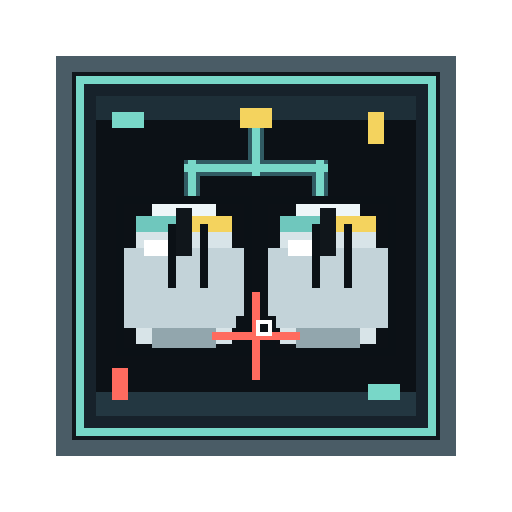

<div align="center">
  

  <h1>Mouse-mouse</h1>

  <p><strong>多实例鼠标键盘分流 · Minecraft 客户端模组</strong></p>
  <p>让两台套键鼠在同一台 PC 上分别控制各自的 Minecraft 窗口</p>

  <p>
    
    
    
    
    
  </p>
</div>

---

## 这个模组是做什么的？

Mouse-mouse 解决一个具体问题：**两个人共用一台电脑同时玩 Minecraft**。

通常情况下，同一台 PC 上开两个 Minecraft 窗口时，两个窗口会争抢同一套鼠标和键盘——只有"当前焦点"窗口能正常接收输入。本模组通过 Windows Raw Input 在系统层捕获多设备输入，然后把每套设备的事件定向路由到各自对应的 Minecraft 实例，让两个窗口互不干扰，各自独立运行。

## 功能

- **独立设备选择** — 每个窗口选择自己的鼠标和键盘，互不抢占
- **虚拟光标** — 菜单界面用虚拟光标接管点击、拖拽和滚轮，与真实鼠标隔离
- **输入隔离** — 未被分配给当前实例的设备输入会被屏蔽，不影响游戏
- **安全键 `Alt + F8`** — 随时打开设备选择界面，同时临时释放鼠标捕获
- **零配置文件** — 设备选择仅保存在运行内存中，无需手动编辑任何配置
- **多实例协作** — 两个实例共用同一个 splitter 进程，自动检测并跳过重复启动

## 安装

> **仅支持 Windows。** 本模组依赖 Windows Raw Input API，Linux 和 macOS 不适用。

### 第一步：下载 splitter.exe

从 [GitHub Releases](https://github.com/kafei520-CN/Mouse-mouse/releases/tag/exe) 下载 `splitter.exe`，放入 Minecraft 实例的 `mods/` 目录：

```
.minecraft/mods/
├── Mouse-mouse-NeoForge-x.x.x+mcx.xx.x.jar   ← 模组本体
└── splitter.exe                                 ← 必须手动下载
```

> `splitter.exe` 是 Raw Input 捕获进程，模组启动时会自动运行它。若 `mods/` 中不存在该文件，模组将无法正常工作。

### 第二步：安装模组

1. 安装对应版本的 **NeoForge** 或 **Fabric**
2. 将模组 `.jar` 文件放入 `mods/` 目录
3. **（Fabric 用户）** 还需要安装 [Fabric API](https://modrinth.com/mod/fabric-api)
4. 确认 `mods/` 目录中已有 `splitter.exe`
5. 启动游戏，进入世界或菜单后按 `Alt + F8` 打开设备选择界面

## 使用方法

### 双人同机

1. 启动第一个 Minecraft 实例
2. 启动第二个 Minecraft 实例
3. 在第一个窗口按 `Alt + F8`，选择第一套键鼠，点击 `Save`
4. 在第二个窗口按 `Alt + F8`，选择第二套键鼠，点击 `Save`
5. 两个窗口现在各自独立响应自己的设备

### 安全键 `Alt + F8`

| 场景 | 效果 |
| --- | --- |
| 想重新选择设备 | 打开设备选择界面 |
| 鼠标被捕获无法移出窗口 | 临时释放鼠标，可操作其他窗口 |
| 选错设备 | 重新进界面取消或更换 |

## 兼容性

| 项目 | 要求 |
| --- | --- |
| Minecraft | 1.21 – 1.21.x |
| NeoForge | 21.1.x |
| Fabric Loader | 0.16.x 或更高 |
| Fabric API | 需要 |
| Java | 21 |
| 操作系统 | **Windows 仅限** |
| 端口占用 | `127.0.0.1:19091`（本机，不对外） |

## 已知限制

- 仅支持 Windows 客户端，不支持 Linux / macOS
- 设备选择不会持久化，每次启动后需要重新选择
- 端口 `19091` 被其他进程占用时模组会启动失败
- 某些虚拟 HID 或触控板设备可能出现在列表中
- 服务端不需要安装本模组（客户端 mod）

## 工作原理

```
物理键鼠 A / 键鼠 B
        │
        ▼
  splitter.exe  (Windows Raw Input)
        │ IPC: 127.0.0.1:19091
        ▼
  Minecraft 实例 A ←── 设备 A 的输入
  Minecraft 实例 B ←── 设备 B 的输入
```

模组启动时运行 `splitter.exe`，它通过 Windows Raw Input 枚举物理设备并建立 IPC 通道。每个 Minecraft 实例声明要接管的设备后，Java 侧接收来自该设备的原始事件，通过 Mixin 注入到 Minecraft 输入管线，菜单操作通过维护独立的虚拟光标完成。


## 许可证

GPL-3.0-only
